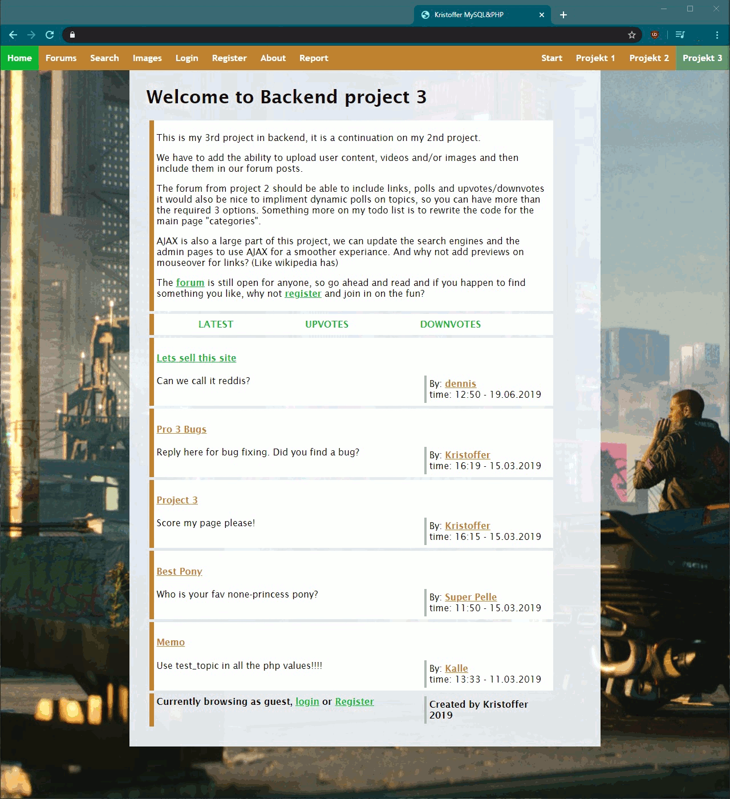

# School-Back-end-programming.Projects01-03
###### PROJECTS 01 - 03
All projects in the course Back-end Programming, which was the third course we took @Arcada in web design that focused on PHP.
Perhaps an unpopular opinion but PHP was a delight to work with and I really felt like I took a bigger leap forward in this course compared to earlier courses @Arcada.
Project 01 is mostly an experiment whereas Project 02 is the beginning to a forum that is finalized in Project 03.

## Installation
None. Database unavailable and host locked behind internal network @Arcada.

## Preview

## Contribution
School project, won't be updated but constructive criticism is welcome.

